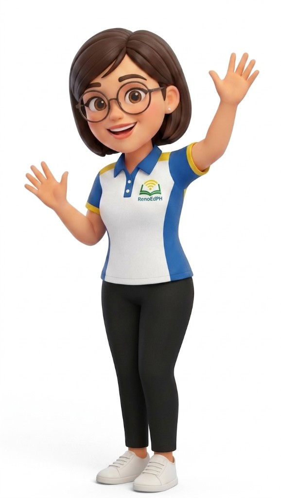
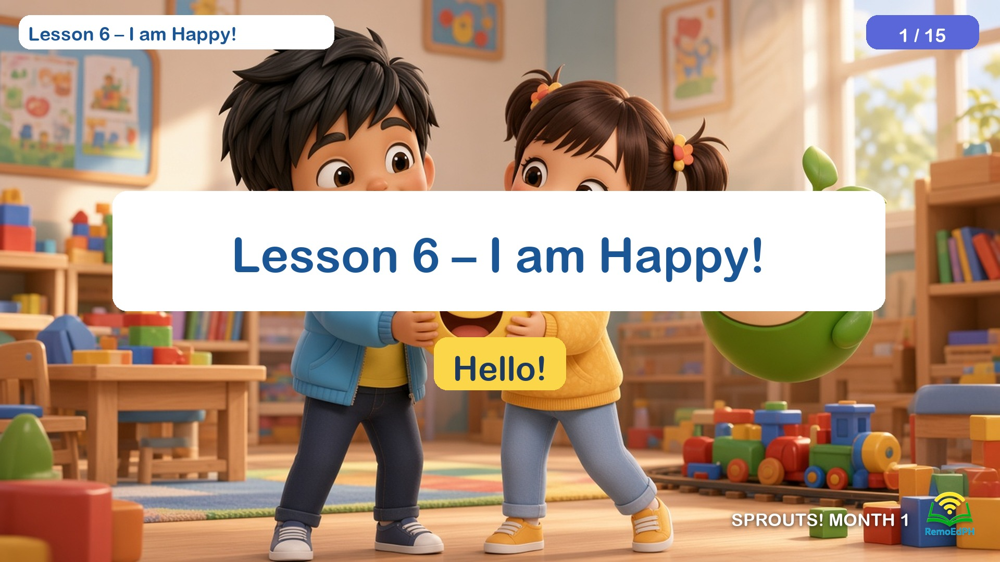
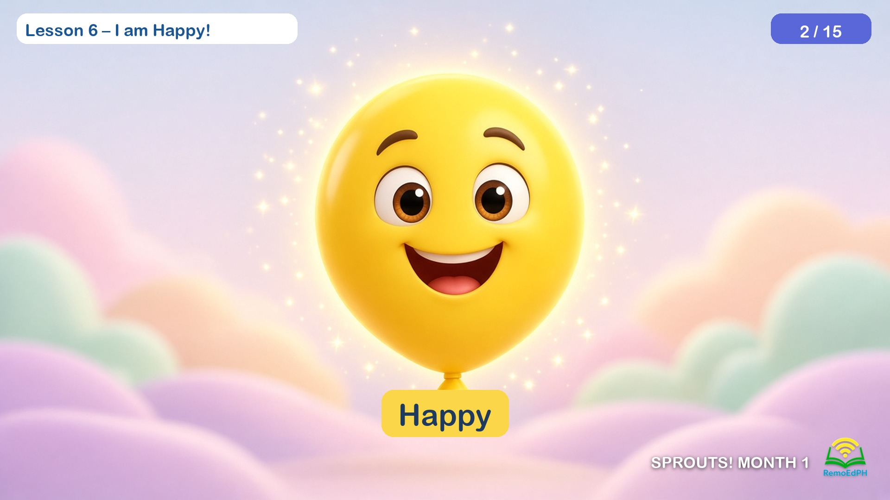

# RemoEd Project Reference

You are an AI developer assistant working on the RemoEd project. Your task is to generate, update, and refactor code while maintaining strict alignment with our project references, brand guidelines, and existing website content.

## Primary Reference Sources

1. **`reference.md` (this file, workspace root):** Always read and consult `reference.md` in the workspace root. This file contains uploaded reference photos, file paths, slides, design specs, and content notes.
2. **Official Website (`https://www.remoedph.com`):** Reference our live website for branding, UI/UX structure, color themes, copywriting, tone of voice, and feature layouts.
3. **Lesson creation skill:** `.cursor/skills/remoed-lesson-creation/SKILL.md` — follow for every slide lesson (characters, chrome, title size, no Teacher Scripts, new-from-scratch designs).
4. **Sample Lesson:** `docs/lesson-references/Sample-Lesson.pptx` (Lesson 6 – I am Happy!) — visual + chrome reference. Original: `D:\Users\Window11\Desktop\JeanDesktop\RemoEdPH\A Lesson and Training Materials\Sample Lesson.pptx`

## Guidelines for Code & Content Generation

- **Check `reference.md` First:** Before writing or modifying components, pages, or content, review `reference.md` for specific details, images, or slide requirements provided for that task.
- **Brand & Website Alignment:** Ensure all styles, UI components, and text copy match the look, feel, and brand identity established on www.remoedph.com.
- **Asset Handling:** Ensure paths, image placeholders, and structural props accurately reflect the uploaded references and file descriptions found in this file.
- **Conflict Resolution:** If there is a discrepancy between `reference.md`, the website, or the current codebase, flag the inconsistency and ask for clarification before writing the code.
- **Curriculum PDFs vs user:** Outline PDFs footer often say “Level 1 / Curriculum Roadmap.” **User confirmed Level 2 – Sprouts** for this Month 1 track — follow the user + this brief, not the PDF footer number.

---

## Lesson character & logo references (canonical)

3D Pixar-style assets for RemoEd lesson slides. Use these paths; do not invent alternate Remo/Ed/Sofie/Grace designs when these exist.

| Asset | Description | Path |
|-------|-------------|------|
| **Ed** | Filipino/Asian boy; messy black hair; light blue puffer jacket over yellow RemoEd tee; navy pants; grey sneakers; joyful arms-up pose | `docs/lesson-references/ed.jpg` |
| **Sofie** | Filipino/Asian girl; dark pigtails with orange/yellow flower ties; yellow hoodie (red drawstrings); light blue jeans; yellow sneakers; waving. Outlines may say “Sophia” — use **Sofie** | `docs/lesson-references/sofie.jpg` |
| **Teacher Grace** | Filipino/Asian woman; glasses; shoulder-length dark hair; white/royal-blue/yellow RemoEdPH polo; black pants; white sneakers; waving | `docs/lesson-references/teacher-grace.png` |
| **Remo** | Cute **green** round robot with sprout on head; peach face panel; black eyes; smile; blush cheeks. **Never** the white robot | `docs/lesson-references/remo-green.jpg` |
| **RemoEd PH logo** | Green open book + yellow signal arcs above sky-blue **RemoEdPH** wordmark — use bottom-right on lesson pages | `docs/lesson-references/remoedph-logo.jpg` |





### Character look notes

- **Remo:** Glossy lime-green sphere, seedling leaves on top, stubby side nubs, soft 3D lighting.
- **Ed:** Warm tan skin, large dark eyes, RemoEd mark on yellow shirt.
- **Sofie:** Warm light-medium skin, rosy cheeks, energetic kid proportions.
- **Teacher Grace:** Friendly teacher look; RemoEdPH badge on left chest of polo.
- **Logo colors:** green book, yellow signal, sky-blue text on white.

### Lesson chrome (from remoed-lesson-creation skill + Sample Lesson.pptx)

On **every** lesson page unless the user overrides. Match the Sample Lesson overlay construction (do not invent a different HUD):

- Slide size: **13.333" × 7.5"** (16:9 widescreen)
- Full-bleed 3D Pixar background (no text baked into the art)
- Font: **Arial Rounded MT Bold**
- Top-left white pill `(0.25, 0.2)` 4.2"×0.45": `Lesson {N} – {Title}` · 14pt · `#1A5696`
- Top-right indigo badge `(11.55, 0.2)` 1.5"×0.45" fill `#5A67D8`: `N / 15` · 14pt white
- Bottom-right, on the art (no white card, border, or badge background): `{LEVEL}! MONTH {M}` (e.g. `SPROUTS! MONTH 1`) in `#FFFFFF` with a dark drop shadow (`0px 2px 4px rgba(0,0,0,0.7)`), then the RemoEd PH logo (`docs/lesson-references/remoedph-logo.jpg`, white plate removed) with `drop-shadow(0px 2px 4px rgba(0,0,0,0.6))`. Row-aligned, about 0.28" from the right edge and 0.22" from the bottom.
- Title page: large white banner title ~**54–60pt** `#1A5696` plus a yellow chip `#FAD648` for the greeting/vocab (28pt `#1E3A5F`)
- Body pages: one large on-screen learner phrase (same yellow/white chip style) — **no Teacher Scripts**
- Always generate new lessons from scratch; do not reuse scene layouts from the sample or previous lessons
- When only adding chrome to existing slides, do not alter existing 3D backgrounds/characters

---

## Sample Lesson (visual + chrome reference)

User source: `D:\Users\Window11\Desktop\JeanDesktop\RemoEdPH\A Lesson and Training Materials\Sample Lesson.pptx`

| Field | Value |
|-------|--------|
| Lesson | **Lesson 6 – I am Happy!** |
| Level | Level 2 – Sprouts · `SPROUTS! MONTH 1` |
| Pages | 15 · 13.333" × 7.5" |
| In-repo copy | `docs/lesson-references/Sample-Lesson.pptx` |
| Folder | `docs/lesson-references/lessons/Sample-Lesson/` |
| Art stills | `docs/lesson-references/lessons/Sample-Lesson/extracted-images/slide-01-pic-1.jpg` … `slide-15-pic-1.jpg` |

Use this file as the **look reference** for 3D Pixar classroom lighting, character likeness (Ed, Sofie, green Remo), overlay chrome, and on-screen-only learner text. The in-repo Sample PPTX has been restyled to the current footer (white `SPROUTS! MONTH 1` + shadowed logo, **no** white card). Re-apply across Sample + L7–12 with `docs/lesson-references/restyle_all_lesson_footers.py`. **Do not copy these Happiness Corner layouts** when generating Lessons 7–9 — new scenes from scratch, same chrome system.





### Sample on-screen text (no Teacher Scripts)

1. Hello!  
2. Happy  
3. Smile  
4. I am happy.  
5. Make a smile!  
6. Happy heart.  
7. Share the joy.  
8. Smile at friends.  
9. Thank you, God.  
10. Touch the happy face!  
11. Touch the happy one!  
12. Your turn!  
13. I am happy.  
14. Happy. Smile.  
15. Goodbye!

---

## Curriculum attachments (Month 1 maps)

Copied from this chat’s uploads into `docs/lesson-references/`. These are the official Month 1 lesson outlines.

| Level | Attachment | Path |
|-------|------------|------|
| Level 1 – Little Seeds | `Level_1__Little_Seeds_-_Month_1.pdf` | `docs/lesson-references/L1M1-Little-Seeds-Month-1.pdf` |
| Level 2 – Sprouts | `Level_2__Sprouts__-_Month_1.pdf` | `docs/lesson-references/L2M1-Sprouts-Month-1.pdf` |
| Level 3 – Saplings | `Level_3__Saplings__-_Month_1.pdf` | `docs/lesson-references/L3M1-Saplings-Month-1.pdf` |
| Level 4 – Young Steward | `Level_4__Young_Steward__-_Month_1.pdf` | `docs/lesson-references/L4M1-Young-Steward-Month-1.pdf` |

Flattened Sprouts extract: `docs/lesson-references/L2M1-Sprouts-Month-1-flat.txt`

### Page-count targets

| Level | Name | Pages per lesson |
|-------|------|------------------|
| 1 | Little Seeds | (follow that level’s outline) |
| 2 | Sprouts | **15** |
| 3 | Saplings | **18–20** |
| 4 | Young Steward | **22–25** |

### Generation workflow

- Generate in batches of **three (3)** lessons per request
- Unique design per lesson (new layouts, not copied)
- 264 lessons per level for a 1-year program
- Match pedagogical structure in the attached PDFs + remoed-lesson-creation skill
- **Publish destination (Level 2 Month 1):** [Google Drive – Level 2 Month 1](https://drive.google.com/drive/u/0/folders/14Fd0Miq10eEIVPCFVgXG36055a9ho3Xk) (`remoedph@gmail.com`). Upload manually when ready.
- **Local save (canonical):** `docs/lesson-references/lessons/L2M1-Lesson-{N}/`
- **Drive-ready filenames for later upload:** `docs/lesson-references/drive-upload-stage/RemoEd L2M1-Lesson-{N}-{Title}.pptx`

### Level 2 – Sprouts · Month 1 – Who Am I? (22 lessons)

Source: `docs/lesson-references/L2M1-Sprouts-Month-1.pdf`

1. I am (Name)
2. Letter A is for Awesome
3. God Made Me Special
4. Straight Lines for A
5. My Name Review
6. I am Happy!
7. Letter B is for Brave
8. Walking for Energy
9. Good Morning, Sun!
10. **The Brave Bird Review**
11. **I am Kind**
12. **Letter C is for Creative**
13. Goodnight, Moon
14. Tracing Curves for C
15. The Creative Cat Review
16. This is My Family *(map also lists Letter D is for Diligent)*
17. Letter E is for Excellent
18. Tracing D and E
19. Honoring My Friends
20. Virtual Garden Challenge 1
21. Virtual Garden Challenge 2
22. Monthly Celebration

**Sample Lesson (chrome + style):** Lesson 6 – I am Happy! — see **Sample Lesson** section above. Do not copy those Happiness Corner layouts for new lessons.

---

## Active lesson brief (Batch D — Lessons 10–12)

| Field | Lesson 10 | Lesson 11 | Lesson 12 |
|-------|-----------|-----------|-----------|
| Level / footer | Level 2 – Sprouts · `SPROUTS! MONTH 1` | same | same |
| Title | **Lesson 10 – The Brave Bird Review** | **Lesson 11 – I am Kind** | **Lesson 12 – Letter C is for Creative** |
| Pages | 1–15 | 1–15 | 1–15 |
| Mode | New from scratch · PowerPoint | same | same |
| Vocab | B, Brave, Morning, Walk | Kind, Share, Friends | C, Creative, Craft · /k/ |
| Sentence | “I am brave.” / “It is morning.” | “I am kind.” | “I am creative.” |
| Design world | Brave Bird Quest | Kindness Circle | Paint Studio Garden |
| Outline | `docs/lesson-references/lessons/L2M1-Lesson-10/L2M1-Lesson-10-outline.txt` | `docs/lesson-references/lessons/L2M1-Lesson-11/L2M1-Lesson-11-outline.txt` | `docs/lesson-references/lessons/L2M1-Lesson-12/L2M1-Lesson-12-outline.txt` |
| Deliverable | `docs/lesson-references/lessons/L2M1-Lesson-10/L2M1-Lesson-10-The-Brave-Bird-Review.pptx` | `docs/lesson-references/lessons/L2M1-Lesson-11/L2M1-Lesson-11-I-am-Kind.pptx` | `docs/lesson-references/lessons/L2M1-Lesson-12/L2M1-Lesson-12-Letter-C-is-for-Creative.pptx` |

Prior batch (done): Lessons 7–9. Do not copy those layouts.

## Previous brief (Batch C — Lessons 7–9, completed)

| Field | Lesson 7 | Lesson 8 | Lesson 9 |
|-------|----------|----------|----------|
| Level / footer | Level 2 – Sprouts · `SPROUTS! MONTH 1` | same | same |
| Title | **Lesson 7 – Letter B is for Brave** | **Lesson 8 – Walking for Energy** | **Lesson 9 – Good Morning, Sun!** |
| Pages | 1–15 | 1–15 | 1–15 |
| Mode | New from scratch · PowerPoint | same | same |
| Vocab | Bb, Brave, Bounce · /b/ | Walk, Energy, Grass | Morning, Sun, Stretch |
| Sentence | “I am brave.” | “I walk for energy.” | “It is morning.” |
| Design world | Hero Garden (blue B glow, brave stance) | Morning Trail (path, march, hiking shoes) | Sunrise Bedroom (pajamas, window sun) |
| Outline | `docs/lesson-references/lessons/L2M1-Lesson-7/L2M1-Lesson-7-outline.txt` | `docs/lesson-references/lessons/L2M1-Lesson-8/L2M1-Lesson-8-outline.txt` | `docs/lesson-references/lessons/L2M1-Lesson-9/L2M1-Lesson-9-outline.txt` |
| Deliverable | `docs/lesson-references/lessons/L2M1-Lesson-7/L2M1-Lesson-7-Letter-B-is-for-Brave.pptx` | `docs/lesson-references/lessons/L2M1-Lesson-8/L2M1-Lesson-8-Walking-for-Energy.pptx` | `docs/lesson-references/lessons/L2M1-Lesson-9/L2M1-Lesson-9-Good-Morning-Sun.pptx` |

### Lesson Progress (remoed-lesson-creation)

```
Lesson Progress:
- [x] Confirm level, month footer, lesson No., title, page count
- [x] Match 3D Pixar-style to previous lessons / reference photos
- [x] Remo = cute green robot (not white)
- [x] Ed, Sofie, Teacher Grace = Filipino / Asian look
- [x] No Teacher Scripts
- [x] Title page: “Lesson No. – (Lesson Title)” ~font 60
- [x] Every page: top-left lesson label, top-right N / total badge
- [x] Every page: bottom-right “SPROUTS! MONTH 1” + RemoEd PH logo
- [x] New art from scratch — unique layout per lesson (do not copy L6)
```

Update this table when the user confirms a lesson, then generate only that brief.
